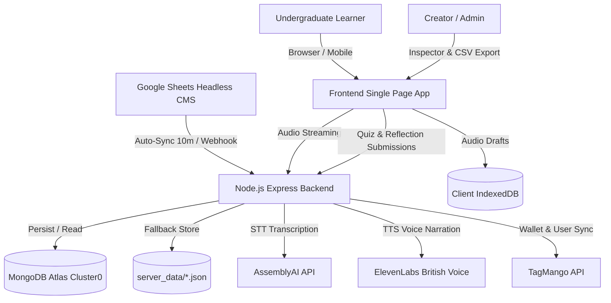

# cMPLiBe Gamification Platform: Master System Architecture & Operations Guide
> **Comprehensive Operational, Technical, & Deployment Reference**  
> **Document Version:** 1.0.0  
> **Last Verified:** September 2026  
> **Repository:** `https://github.com/cmplibe-sai/gamification.git`  
> **Branch:** `main`  
> **Production Host:** Hostinger VPS (`learn.cmplibe.com` / `cmplibe.com`)  
> **Primary Git Author & Committer:** `saikumaryadiki@gmail.com` (`cmplibe-sai`)  

---

## Table of Contents
1. [Executive Summary & Fundamentals](#1-executive-summary--fundamentals)
2. [Git & GitHub Operations](#2-git--github-operations)
3. [Infrastructure & Hosting (Hostinger VPS vs Render)](#3-infrastructure--hosting-hostinger-vps-vs-render)
4. [Administrative Ownership & Access Control](#4-administrative-ownership--access-control)
5. [Database Architecture, File Stores & Backups](#5-database-architecture-file-stores--backups)
6. [Hostinger VPS Terminal Commands & Operational Workflows](#6-hostinger-vps-terminal-commands--operational-workflows)
7. [Third-Party APIs, SDKs & External Engines](#7-third-party-apis-sdks--external-engines)
8. [Core Modules & Implemented Features](#8-core-modules--implemented-features)
9. [Comprehensive Bug Fix & Engineering Changelog](#9-comprehensive-bug-fix--engineering-changelog)
10. [Troubleshooting & Emergency Playbook](#10-troubleshooting--emergency-playbook)

---

## 1. Executive Summary & Fundamentals

The **cMPLiBe Gamification Platform** is an enterprise-grade student learning journey web application built to gamify daily business and industry education for undergraduate students. The platform bridges daily real-world business case studies, interactive audio-driven podcasts, voice reflections, and automated coin rewards synced directly with the **TagMango** ecosystem.

### High-Level Architecture Flow


---

## 2. Git & GitHub Operations

### Repository Details
- **Repository URL:** `https://github.com/cmplibe-sai/gamification.git`
- **Default & Production Branch:** `main`
- **Git Push/Commit Account:**
  - **Git Username:** `cmplibe-sai`
  - **Git Email:** `saikumaryadiki@gmail.com`

### What is Being Pushed to GitHub?
Only clean application source code, assets, and seed data are pushed to GitHub. Dynamic runtime state, secrets, and large uploads are strictly ignored via `.gitignore`:
1. **Tracked Files Pushed to Remote:**
   - Backend service: `server.js`, `api.js`, `package.json`, `package-lock.json`
   - Frontend application: `index.html`, `app.js`, `styles.css`, `data.js`, `timeline.js`, `users.js`, `scores.js`, `courses.js`
   - Static/Seed datasets: `data/pod_quiz_pool_snabbit.json`, `data/pod_quiz_pool_athulya.json`, `data/pod_quiz_pool_kirloskar.json`, `data/pod_quiz_pool_kirloskar.csv`
   - Seed audio assets: `data/uploads/snabbit_podcast_ep1.wav`
   - Documentation & environment templates: `.env.example`, `README.md`, `tagmango.http`
2. **Untracked Files Kept Local (.gitignore):**
   - `.env` (contains sensitive API keys, secret salts, database connection strings)
   - `node_modules/` (installed NPM packages)
   - `server_data/` (runtime local databases: `gamification_store.json`, `milestone_configs.json`, live student audio/video uploads)

---

## 3. Infrastructure & Hosting (Hostinger VPS vs Render)

### Are We Using Render?
- **Historical Context:** Render was initially evaluated and used for early deployment testing. The codebase still retains `/health` and `/api/health` endpoints designed for Render's zero-downtime health-check pings.
- **Active Production Reality:** The live platform is **NOT running on Render**. It is deployed and hosted on a dedicated **Hostinger Virtual Private Server (VPS)**.
- **Production Domain:** `https://learn.cmplibe.com` (proxied to `cmplibe.com/gamification`).
- **Server Environment:** Ubuntu Linux LTS on Hostinger VPS, running **Node.js (>= 18.0.0)** managed continuously by **PM2 (Process Manager 2)** behind an **Nginx** reverse proxy with SSL certificates.

---

## 4. Administrative Ownership & Access Control

### Owner and Admin Credentials
The system evaluates administrative permissions server-side and client-side via authorized emails and mobile numbers configured in `.env` and `server.js`.

#### Platform Admins:
- `cmplibesai@gmail.com`
- `cmplifutureadi@gmail.com`
- `cmplibecynthiya@gmail.com`
- `saikumaryadiki@gmail.com`
- `admin@cmplibe.com`
- **Authorized Admin Phone Numbers:** `6309764212`, `9845421644`

#### TagMango Organization Details:
- **TagMango Host URL:** `learn.cmplibe.com`
- **TagMango Base URL:** `https://api-prod-new.tagmango.com/api/v1`
- **TagMango Creator ID:** `6682734e120c766a6e5af59c`
- **Admin Secret (`CREATOR_ADMIN_SECRET`):** A high-entropy cryptographic salt stored in `.env` used to issue time-limited, signed HMAC tokens for creator inspection of the 50-question quiz pools and CSV downloads.

---

## 5. Database Architecture, File Stores & Backups

The application uses a **fail-safe dual-layer storage architecture**: a cloud-native MongoDB Atlas database combined with a resilient local JSON file store. If MongoDB is temporarily unreachable or has DNS lookup delays, the system seamlessly falls back to local disk storage without dropping student submissions.

```
+-------------------------------------------------------------------------+
|                        APPLICATION STORAGE ENGINE                       |
+-------------------------------------------------------------------------+
       |                                                 |
       v [Primary]                                       v [Persistent Fallback]
+-------------------------------+              +----------------------------------+
|      MongoDB Atlas            |              |      Local JSON File Store       |
| (Cloud Cluster: cluster0)     |              | (Directory: ./server_data/)      |
| - Submissions Collection      |              | - gamification_store.json        |
| - Users Collection            |              | - milestone_configs.json         |
| - Wallet Logs                 |              | - user_module_start_dates.json   |
+-------------------------------+              | - uploads/ (MP3/WAV/WebM)        |
                                               +----------------------------------+
```

### 1. MongoDB Atlas (Cloud Database)
- **Cluster:** `cluster0.3b0tjez.mongodb.net`
- **Database Name:** `cmplibe_gamification`
- **Connection Variable in `.env`:** `MONGODB_URI=mongodb+srv://saikumaryadiki_db_user:<password>@cluster0.3b0tjez.mongodb.net/cmplibe_gamification?retryWrites=true&w=majority`
- **DNS Resilience:** In `server.js`, custom DNS servers (`8.8.8.8`, `8.8.4.4`, `1.1.1.1`) are injected via `dns.setServers()` to prevent Node.js SRV lookup failures common on VPS networks.
- **How to view MongoDB data:**
  1. Go to [cloud.mongodb.com](https://cloud.mongodb.com) and log in with your Atlas credentials.
  2. Select **Cluster0** -> Click **Database** -> Click **Browse Collections**.
  3. Inspect collections: `submissions` (all student answers, scores, timestamps), `users` (user metadata), and `milestone_configs`.

### 2. Local Persistent File Stores (`server_data/`)
Located on the Hostinger VPS at `/path/to/app/server_data/`:
- `gamification_store.json`: Flat-file ledger storing user profiles, submission attempts, evaluation scores, and coin balances.
- `milestone_configs.json`: Contains live curriculum data synced from Google Sheets, including article text, main questions, submission windows, audio URLs, and full 50-question quiz pools.
- `user_module_start_dates.json`: User-specific onboarding dates that govern cohort milestone unlock schedules.
- `uploads/`: Stores voice notes recorded by students (`.webm`, `.m4a`, `.wav`) and podcast narrations generated by ElevenLabs (`pod_m1_*.mp3`).

### 3. Client-Side Resilience (Browser IndexedDB)
- **`AudioDraftStore`:** An in-browser IndexedDB database initialized in `app.js`. Every 10 seconds while a student is recording a voice reflection, raw Web Audio PCM / WebM chunks are cached locally. If the browser tab crashes, the student can refresh and resume recording without losing their progress.

### 4. Backup & Recovery Playbook
To ensure zero data loss, execute regular backups on the Hostinger VPS:

#### A. Backing Up Local Files & Media (Weekly or Before Updates)
Run in the Hostinger VPS terminal:
```bash
# Navigate to the application root
cd /home/cmplibe/gamification    # (or your specific VPS deploy path)

# Create a timestamped compressed archive of server_data and .env
tar -czvf backup_cmplibe_$(date +%F_%H%M%S).tar.gz server_data/ .env

# Verify the backup archive size
ls -lh backup_cmplibe_*.tar.gz
```

#### B. Backing Up MongoDB Atlas Database
Run on the VPS (or local terminal with MongoDB Database Tools installed):
```bash
mongodump --uri="mongodb+srv://saikumaryadiki_db_user:<password>@cluster0.3b0tjez.mongodb.net/cmplibe_gamification" --out=/var/backups/mongo_$(date +%F)
```

#### C. Restoring from Backup
- **Restoring Local Files:**
  ```bash
  tar -xzvf backup_cmplibe_YYYY-MM-DD_HHMMSS.tar.gz
  pm2 restart all
  ```
- **Restoring MongoDB:**
  ```bash
  mongorestore --uri="mongodb+srv://saikumaryadiki_db_user:<password>@cluster0.3b0tjez.mongodb.net/cmplibe_gamification" /var/backups/mongo_YYYY-MM-DD/cmplibe_gamification
  ```

---

## 6. Hostinger VPS Terminal Commands & Operational Workflows

Here is the exact catalog of terminal commands used on the Hostinger VPS, why each is used, and what it achieves under the hood.

### Command Reference Table
| Command | Purpose & Description | When to Use |
| :--- | :--- | :--- |
| `git status` | Displays working tree status, showing modified, untracked, or staged files. | Before pulling or editing to verify directory cleanliness. |
| `git pull origin main` | Connects to GitHub, downloads new commits on `main`, and merges them into the VPS directory. | Whenever new code or bug fixes are pushed to GitHub. |
| `git log -n 5 --oneline` | Displays the last 5 commit hashes and titles on the VPS. | Immediately after pulling to verify the VPS matches the remote commit. |
| `node --check server.js` | Runs Node.js syntax parser without executing code. Detects missing brackets, syntax errors, or typo crashes. | **Mandatory pre-flight check** before restarting the server. |
| `npm install --omit=dev` | Installs or updates dependencies listed in `package.json` without developer packages. | When new libraries (e.g. `mongoose`, `dotenv`) are added. |
| `pm2 status` | Lists all running processes managed by PM2, showing process ID, status (`online`/`errored`), CPU %, RAM, and restart count. | To check health and uptime of the web service. |
| `pm2 restart all` | Performs a graceful reload/restart of the application processes running under PM2. | After running `git pull origin main` so the new code takes effect. |
| `pm2 logs --lines 50` | Streams the last 50 lines of live stdout and stderr server logs. | To observe Google Sheet syncs, MongoDB connection, or debug errors. |
| `pm2 save` | Freezes and saves the current active process list into PM2 boot configuration. | After starting or configuring new PM2 instances so they restart on reboot. |
| `pm2 startup` | Generates and configures systemd startup scripts to ensure PM2 launches on VPS system boot. | One-time server setup. |

> [!NOTE]
> **What does RSPM mean?**  
> In server administration, users occasionally type "RSPM" as an abbreviation or shorthand for *"Restart PM2"* (`pm2 restart all`) or referring to a process restart command. PM2 is the actual daemon managing your Node.js application in production.

### Standard Production Deployment Workflow
Whenever you push code fixes from your local machine to GitHub, execute this exact sequence in the Hostinger VPS terminal:

```bash
# 1. Navigate to the project directory
cd /var/www/gamification   # (replace with your active folder)

# 2. Check current state
git status

# 3. Pull latest commits from GitHub
git pull origin main

# 4. Verify syntax before reloading
node --check server.js

# 5. Restart the PM2 process
pm2 restart all

# 6. Monitor real-time logs for 15 seconds to confirm clean startup
pm2 logs --lines 40
```

---

## 7. Third-Party APIs, SDKs & External Engines

The platform integrates four key external APIs to automate its workflows:

### 1. TagMango Ecosystem Integration
- **Role:** Handles student user verification, cohort access, and automatic coin debit/credit transactions.
- **Key Files:** `server.js` (lines 328-400), `app.js`
- **Environment Variables:** `TAGMANGO_KEY`, `HOST_URL=learn.cmplibe.com`, `BASE_URL=https://api-prod-new.tagmango.com/api/v1`, `CREATOR_ID=6682734e120c766a6e5af59c`
- **Functionality:** When students submit on-time or late reflections, the server computes points and dispatches an authenticated HTTP POST to TagMango's wallet ledger API to update the student's real wallet balance.

### 2. AssemblyAI (Speech-to-Text Reflection Evaluation)
- **Role:** Automated AI transcription of student voice notes.
- **Key File:** `server.js`
- **Environment Variable:** `ASSEMBLYAI_API_KEY`
- **Functionality:** When an audio reflection (`.webm`/`.m4a`) is submitted, the server streams the audio to AssemblyAI, polls for transcription completion, and analyzes the resulting text against the daily reflection rubric to assign objective marks.

### 3. ElevenLabs (SimpliPod Cloned British Voice Engine)
- **Role:** Text-to-Speech synthesis converting written business stories into professional audio narrations.
- **Key File:** `server.js` (`/api/pod/generate-voice`)
- **Environment Variables:** `ELEVENLABS_API_KEY`, `ELEVENLABS_VOICE_ID=9XoiuCBdWP6fgkEbTNW0`
- **Calibration Parameters:**
  - `stability: 0.38` (dynamic, expressive British narrative tone)
  - `similarity_boost: 0.85` (high fidelity to the cloned reference voice)
  - `style: 0.20` (subtle stylistic pacing without audio artifact distortion)
  - Currency normalization: Automatically parses `Rs. 50 crore`, `$10M`, `AU$ 25M` into spoken phonetic words (`50 crore rupees`, `10 million dollars`).

### 4. Google Sheets Headless CMS
- **Role:** Enables the editorial and curriculum team to publish daily stories, questions, and timing windows without touching code.
- **Default Spreadsheet ID:** `1uiiUiqJ-_wtOzbtBZwFuaOS0C6NlV405ZE4RCdTy7VU`
- **Sync Mechanism:**
  - Automated recurring background sync running every 10 minutes (`GOOGLE_SHEET_SYNC_INTERVAL_MS`).
  - Instant manual trigger via creator endpoint `POST /api/sync-google-sheet`.
  - Smart Diff: Compares hash signatures; only writes to disk and triggers regeneration if actual changes occur.

---

## 8. Core Modules & Implemented Features

### Module Overview
The platform organizes student learning into three sequential modules:
1. **SimplyDeep (Milestone 1 - Daily Industry Deep Dives):**
   - Daily business case study articles.
   - Text reflection submissions with character limits.
   - 3-4 minute voice note recording with integrated audio player, waveform visualizer, pause/resume, and teleprompter.
   - Audio draft auto-save via IndexedDB every 10 seconds.
2. **SimplyPod (Milestone 2 - Audio Podcast & 50-Question Quiz Bank):**
   - High-fidelity audio narration with playback speeds (0.75x, 1.0x, 1.25x, 1.5x, 2.0x).
   - Audio lock protection: Students must listen before taking the quiz (with graceful fallback if audio player fails).
   - 50-question comprehensive quiz pool per business story (Athulya, Snabbit, Kirloskar, or dynamic AI generation).
   - Randomized selection of 5 questions per student session.
   - 5-minute timed exam with automatic submission on timer expiry.
   - Creator Inspector: Admin modal allowing questions review and instant CSV download (`downloadPodQuizPoolCSV`).
   - Retained audio player in post-submission review screen.
3. **SimplyMy / LevelUp (Milestone 3 - Video Presentations & Milestones):**
   - Video upload reflections for capstone presentations.
   - Cohort calendar locking: Users cannot skip ahead; modules unlock based on user onboarding dates (`user_module_start_dates.json`).

---

## 9. Comprehensive Bug Fix & Engineering Changelog

Here is the chronological record of critical issues discovered, audited, and permanently resolved across our development cycles:

| Commit / Audit | Area | Bug / Problem Statement | Root Cause | Permanent Resolution |
| :--- | :--- | :--- | :--- | :--- |
| `a46c91d` | SimpliPod Audio | Milestone 2 or higher unconfigured stories were playing Milestone 1 Athulya audio. | `resolvePodAudioUrl` lacked milestone validation on legacy fallback paths. | Gated legacy curated fallback strictly to `targetMs === '1'`. Milestone 2+ returns empty string if unconfigured. |
| `3f2b2d3` | SimpliPod Audio | Students were locked out of quiz if audio file failed to load (network error / missing codec). | Quiz unlock was tied strictly to `audio.ended` or `audio.timeupdate`. | Added `audio.addEventListener('error')` and a 12-second safety timer to automatically unlock the quiz questions. |
| `3f2b2d3` | Performance | Server was running repeated synchronous `fs.existsSync` calls on disk for every client audio check. | No memory/disk caching of verified audio URLs. | Discovered audio URLs are now written directly to `milestone_configs.json` upon first detection. |
| `8b70817` | Creator Portal | Creator received popup *"No questions loaded to download"* when clicking CSV export. | Variable `_podInspectorCurrentQuestions` was cleared or queried before async fetch completed. | Fixed synchronous fallback chain: `_podInspectorCurrentQuestions` -> `_podQuizPoolMap[dateKey]` -> `customMilestoneConfigs` -> alert. |
| `9e0357e` | Question Pool | Questions displayed truncated text in the student UI; duplicate questions in Kirloskar dataset. | Unescaped double quotes (`"`) inside JSON strings broke HTML attribute parsing; identical prompt stems were repeated. | Replaced Kirloskar pool with 50 curriculum-grade UG-level MCQs; implemented HTML quote entity escaping (`&quot;`) in template renderers. |
| `2692163` | Google Sync | Aggressive sync loops caused high CPU usage when interval env variable was misconfigured. | Unclamped `GOOGLE_SHEET_SYNC_INTERVAL_MS`. | Clamped sync interval using `Math.max(60000, interval)` to guarantee at least 60 seconds between syncs. |
| `095c73f` | Google Sync | Server crashed during Google Sheet sync with `ReferenceError: rawArticle is not defined`. | Variable renaming typo in `server.js` row parser. | Corrected reference to `articleText` / `description` and added fallback safeguards. |
| `c26309b` | Dynamic Pool | When story content was updated in Google Sheets, old quiz questions persisted. | `getPodQuizPoolForDate` only checked if questions array was non-empty. | Added `forceRegenerate: storyChanged` flag to trigger re-generation when story hash changes. |
| `379d8db` | Google Sync | Timing windows with `HH:MM:SS` format (e.g. `09:00:00 - 21:00:00`) failed to parse. | Regex only expected `HH:MM AM/PM` or `HH:MM`. | Enhanced `normalizeTime` to strip seconds and normalize 24-hour and 12-hour timestamps cleanly. |
| `e2eae2b` | Google Sync | Header detection falsely matched `lc_on_time` as `late` due to token collision. | Blacklist filter was overly broad. | Scoped candidate-aware blacklist to prevent false veto on `lc`, `late`, and `milestone` columns. |
| `82093b2` | Security | Creator admin token generation accepted default fallback secret. | Fallback secret was hardcoded in source. | Removed fallback; strictly enforced `process.env.CREATOR_ADMIN_SECRET` with timing-safe comparison (`crypto.timingSafeEqual`). |
| `76a989c` | Audio Drafts | Audio recordings were lost if the browser tab refreshed mid-recording. | Audio was kept only in volatile RAM buffers. | Integrated Web Audio PCM buffer concatenation with browser IndexedDB auto-save every 10 seconds. |

---

## 10. Troubleshooting & Emergency Playbook

### 1. Server Returns 502 Bad Gateway
- **Cause:** Node.js process crashed or failed to start.
- **Fix:**
  ```bash
  pm2 status
  pm2 logs --lines 30 --err
  node --check server.js
  pm2 restart all
  ```

### 2. Audio Fails to Play in cMPLi POD
- **Cause:** The MP3 file does not exist in `server_data/uploads/` or has bad permissions.
- **Fix:**
  ```bash
  ls -lh server_data/uploads/
  # Check if pod_m1_YYYY_MM_DD.mp3 exists.
  # If missing, open Admin Portal and trigger ElevenLabs synthesis, or upload the audio directly.
  ```

### 3. Google Sheet Changes Not Showing Up
- **Cause:** Periodic sync hasn't run yet, or Google Sheet permissions were set to private.
- **Fix:**
  1. Confirm the Google Sheet is shared with *"Anyone with the link can view"*.
  2. Trigger manual sync via terminal or browser:
     ```bash
     curl -X POST https://learn.cmplibe.com/api/sync-google-sheet
     ```
  3. Inspect output logs: `pm2 logs | grep GoogleSheetSync`

### 4. Student Quiz Stuck on "Audio Required"
- **Automatic Fallback:** The player contains an automated safety bypass that unlocks questions if audio fails or after 12 seconds of playback interruption.
- **Manual Verification:** Open browser DevTools console (F12) -> check for CORS or 404 on the audio source URL.

---

## 11. Intra-Milestone Module Prerequisite Engine (Self-Efficacy Privilege Model)

### Philosophy & Architecture
Milestones contain sequential modules (`cMPLi Dip` -> `cMPLi POD` -> `cMPLi Immerse` -> `Real-World Projects` -> `Problem-Solution Briefings` -> `Corporate Residency`). To instill genuine self-efficacy and prevent cognitive overload, modules are not given freely: **learners earn the privilege of accessing subsequent modules step-by-step** (the "biryani starter -> main dish -> dessert" model).

1. **Entry Module (`cMPLi Dip`):**
   - Constant and unconditional for everyone entering the milestone.
   - Requires zero prerequisites.
2. **Sequential Progressive Disclosure ("Fog-of-War"):**
   - Learners can only see the challenges and prerequisites for the **immediate next module in sequence**.
   - Example: While working on `cMPLi Dip`, `cMPLi POD` displays its active unlock targets. Advanced modules (`cMPLi Immerse`, `Projects`) remain in **Sequential Stage Gate**, gently notifying the learner: *"Complete and unlock cMPLi POD first to reveal this module's challenges."*
3. **Dual-Criteria Evaluation (Activities/Days AND Learning Currencies):**
   - Access requires fulfilling both:
     - **Minimum Check-in Activities / Days** completed in previous modules within that milestone.
     - **Minimum Learning Currencies (LCs)** accumulated in those specific modules within that milestone.
   - If even one criterion is unmet, the module remains safely locked.
4. **Server Endpoints & Sync:**
   - `GET /api/module-prereqs`: Delivers milestone module prerequisite targets.
   - `POST /api/module-prereqs`: Allows creators to customize dual targets (days + LCs) from the Creator Dashboard, persisting to `data/module_prereqs.json` and MongoDB.
   - Bundled into `/api/sync` (`modulePrereqs: getModulePrereqsFromDb()`) for real-time multi-device synchronization.
5. **Client Evaluation & UI:**
   - Evaluated dynamically in real-time via `evaluateModulePrereqs(currentUser, msId, modCode, checkSequential = true)`.
   - Displays amber lock badges in the sub-nav.
   - Gated cards feature animated progress bars, live counts (e.g. `3 / 5 Check-ins`, `33 / 50 LCs`), completion status badges, and direct CTA buttons guiding the learner back to the relevant prerequisite module.
   - Platform admins and test users automatically bypass locks for instant audit and demonstration.

---

*This guide is permanently saved in the codebase repository root as `MASTER_SYSTEM_ARCHITECTURE_AND_OPERATIONS_GUIDE.md`.*
